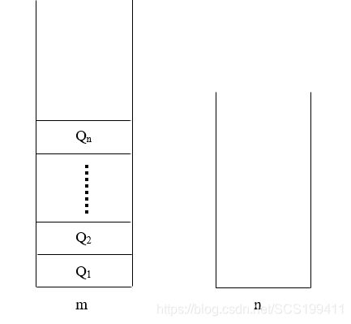
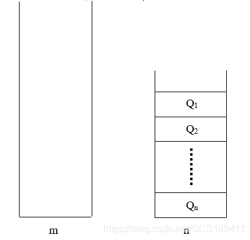
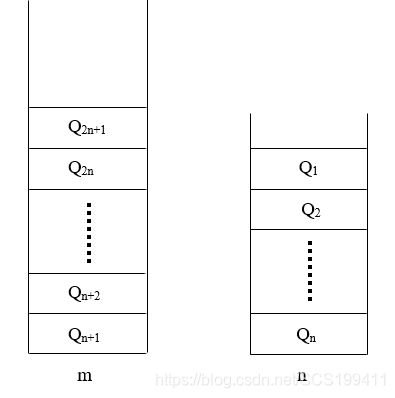
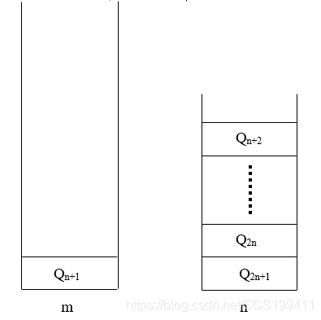

## 题目描述

如何用两个栈模拟实现一个队列? 如果这两个堆栈的容量分别是m和n（m>n)，你的方法能保证队列的最大容量是多少？（这里讨论的是顺序栈，如果是链式栈的话完全没有必要考虑空间）

## 解答

分析：栈的特点是“后进先出(LIFO)”，而队列的特点是“先进先出(FIFO)”。用两个栈模拟实现一个队列的基本思路是：用一个栈作为存储空间，另一个栈作为输出缓冲区，入队时把元素按顺序压入两栈模拟的队列，出队时按入队的顺序出栈即可。

如下图，用容量为m（较大的）的栈作为存储空间，容量为n的栈作为输出缓冲区，先将入队的前n个元素push进存储空间栈

随后对存储空间栈中的每个元素进行出栈(pop)操作，继而压入(push)输出缓冲区栈，如下图所示

对于剩余入队的前n+1个元素，将他们压入存储空间栈，两个栈的状态如下图：

此时已经入队了2n+1个元素，若此时进行出队操作，先将输出缓冲区栈中的元素出栈(pop)并输出：Q1,Q2,......,Qn，再对存储空间栈中的n个元素进行出栈(pop)并压入输入缓冲区栈，状态图如下：

然后对存储空间栈进行一次出栈(pop)操作并输出：Q{n+1}，最后再对输出缓冲区栈中的所有元素进行出栈(pop)操作并输出Q{n+2},Q{n+3},......,Q{2n},Q{2n+1}。这样两个栈总的输出序列为：Q1,Q2,......,Qn,Q{n+1},Q{n+2},Q{n+3},......,Q{2n},Q{2n+1}，符合队列“先进先出”的特性，模拟成功。

但是如果前面蓝字的假设不成立，即在已经入队了2n+1个元素的情况下，还要继续向队列中添加更多的元素，将无法满足按入队的顺序出队。

综上所述，两个栈所模拟的队列的最大容量为2n+1。

## 参考链接

- [用两个栈模拟实现一个队列，其最大容量是多少](https://blog.csdn.net/SCS199411/article/details/91443928)
